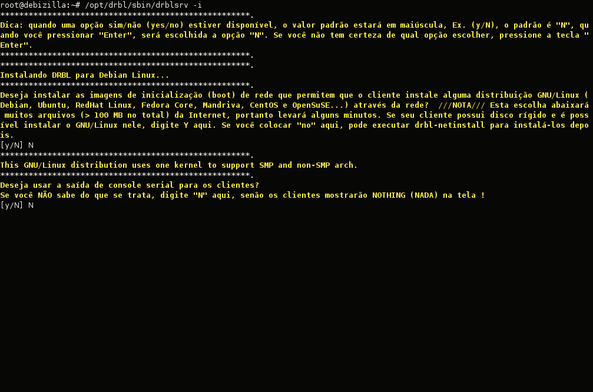
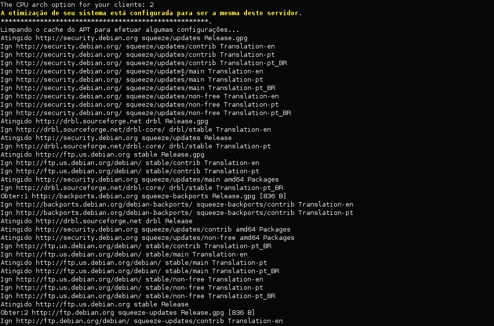
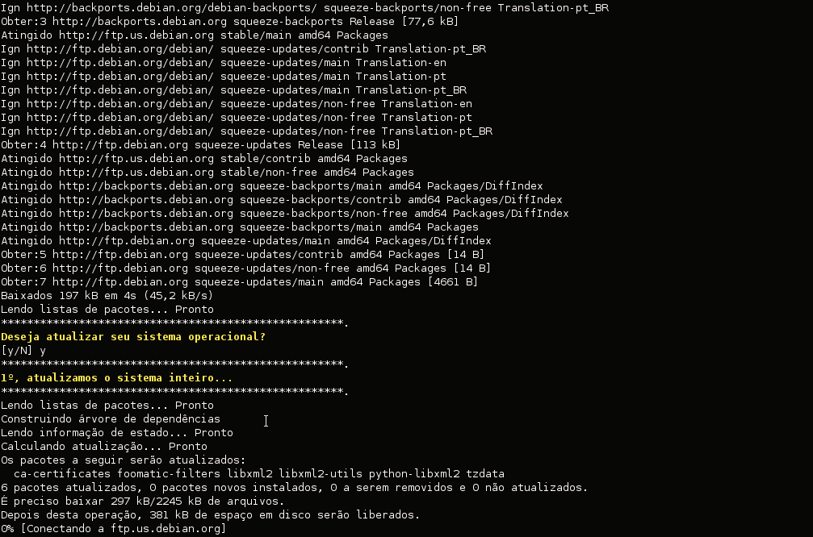
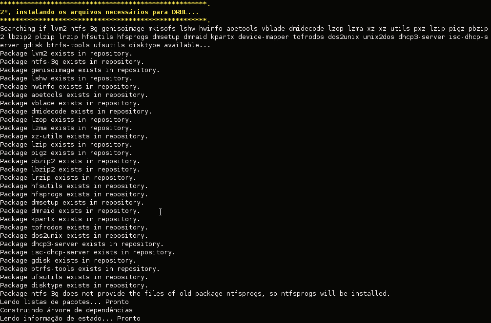
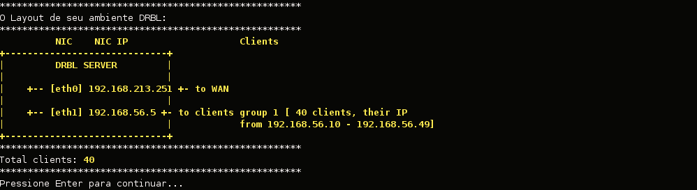

# Clonezilla Server Edition (SE) — Parte 2  
## Página 2 — Preparando o Servidor Clonezilla SE

Antes de prosseguir com o uso do Clonezilla Server Edition, é necessário configurar corretamente a interface de rede que fará a comunicação com os clientes.

---

# 🔧 Configurando a interface de rede

Edite o arquivo: /etc/network/interfaces

Exemplo de configuração usada no artigo — ajuste conforme sua rede:

````
iface eth1 inet static
address 192.168.56.5
netmask 255.255.255.0
broadcast 192.168.56.255
network 192.168.56.0
````

Após realizar as modificações, reinicie o serviço de rede:

````
service networking restart
````

A partir daqui o servidor DRBL já está instalado.
O próximo passo é preparar o ambiente para colocá-lo em produção.

#####################################################################################

🛠️ Preparando o Servidor Clonezilla

O pacote DRBL fornece todos os componentes que o Clonezilla Server precisa, como:

- NFS
- DHCP
- TFTP
- NIS
- Partimag directories
- Kernel PXE
- Scripts do clonezilla-server

Para iniciar a preparação, execute:

````
/usr/sbin/drblsrv -i
````
Esse comando inicia um assistente interativo onde você confirma ou altera cada configuração.

🧩 Processo do drblsrv -i
1️⃣ Permissão para instalar Linux via rede

O sistema perguntará:

| Deseja permitir instalação de distribuições GNU/Linux nas máquinas clientes?

Como neste artigo usamos apenas o Clonezilla Server, responda:
````
N
````
E depois novamente:
````
N
````


2️⃣ Atualização da lista de pacotes

Será exibida a opção para atualizar o sistema.
Recomenda-se aceitar:
````
Y
````




O sistema atualizará pacotes e instalará automaticamente dependências do DRBL.

3️⃣ Atualização do kernel

O script verificará se o kernel atual tem suporte completo para NFS/PXE.

Quando solicitado:

| Método para atualizar o kernel?

Escolha:
````
2 – Atualizar via repositório APT
````
Depois disso, o procedimento prossegue e gera os arquivos de configuração do ambiente cliente.


