# Clonezilla Server Edition (SE) — Parte 2  
## Página 4 — Clonagem de Discos pela Rede

Agora que o servidor Clonezilla está configurado, chegou o momento de habilitar o serviço e realizar clonagens pela rede.  
Antes de tudo, certifique-se de que as máquinas clientes estão configuradas para **boot via PXE** (inicialização pela rede).

---

# 🚀 Habilitando o Servidor Clonezilla

Para iniciar o serviço no servidor Clonezilla, execute:

```
/usr/sbin/dcs clonezilla-start
````
A primeira tela exibida será semelhante à imagem abaixo:


1️⃣ Selecionando os clientes que serão clonados

Escolha:

````
All
````
Isso fará com que todas as máquinas que inicializarem pela rede sejam clonadas.

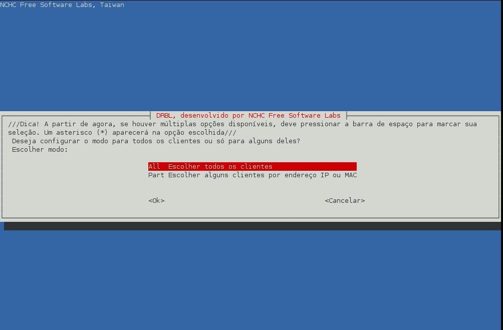


2️⃣ Escolha o modo de execução

Selecione o modo:
````
Expert
````
Para acessar configurações avançadas.


3️⃣ Definindo o tipo de operação

Escolha:
````
save-disk
````
Pois queremos clonar um disco inteiro das máquinas clientes.

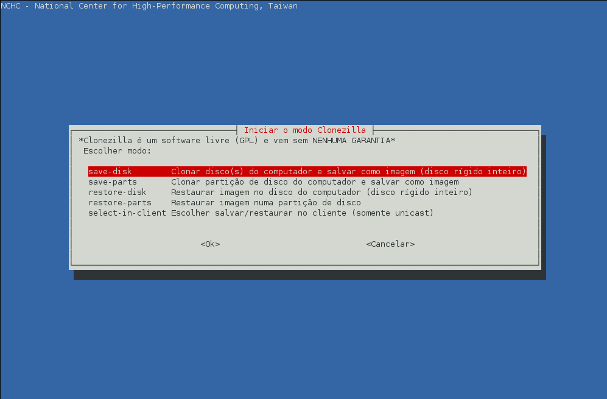

4️⃣ Escolhendo onde nomear a imagem

Selecione:
````
Later_in_client
````
Assim, o cliente informará o nome da imagem e qual disco deve ser clonado.

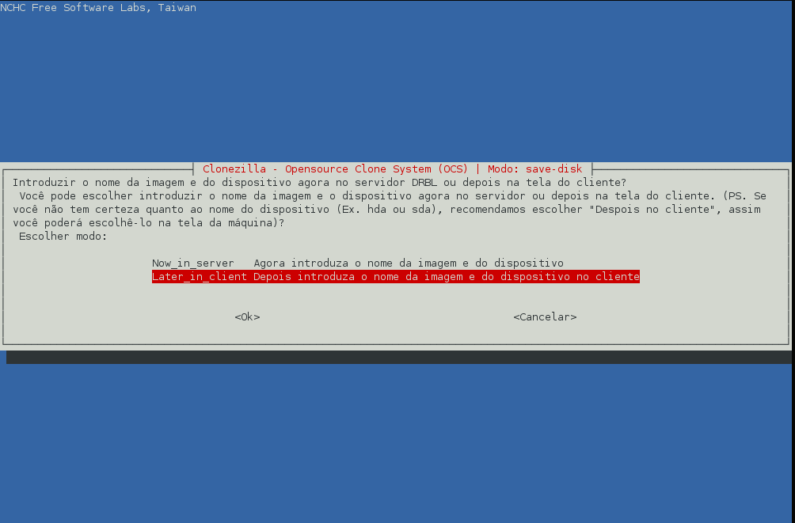

5️⃣ Prioridade de aplicativos usados

Selecione:
````
-q2
````
Isso fará o servidor priorizar:
  - Partclone
  - Partimage
  - dd (como último recurso)

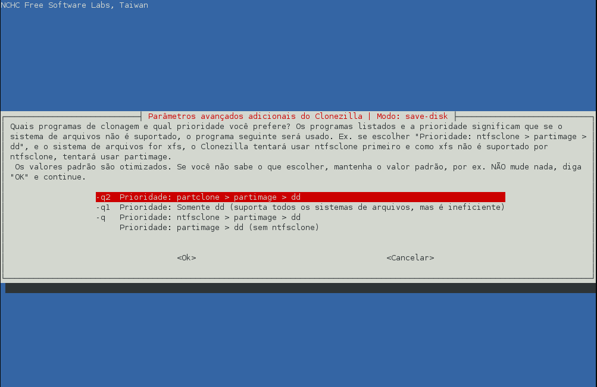

6️⃣ Definindo parâmetros importantes

Habilite:
  -j2 → copia dados ocultos da MBR

  -rescue → ignora setores defeituosos

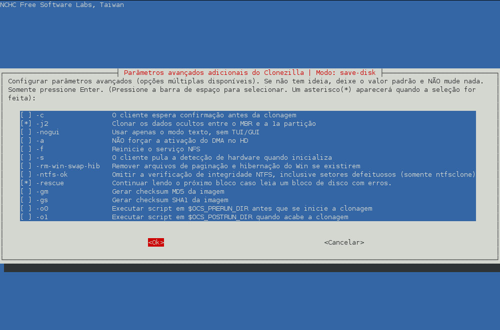

7️⃣ Ignorar verificação do sistema de arquivos

Selecione:
````
Skip checking/repairing source file system
````

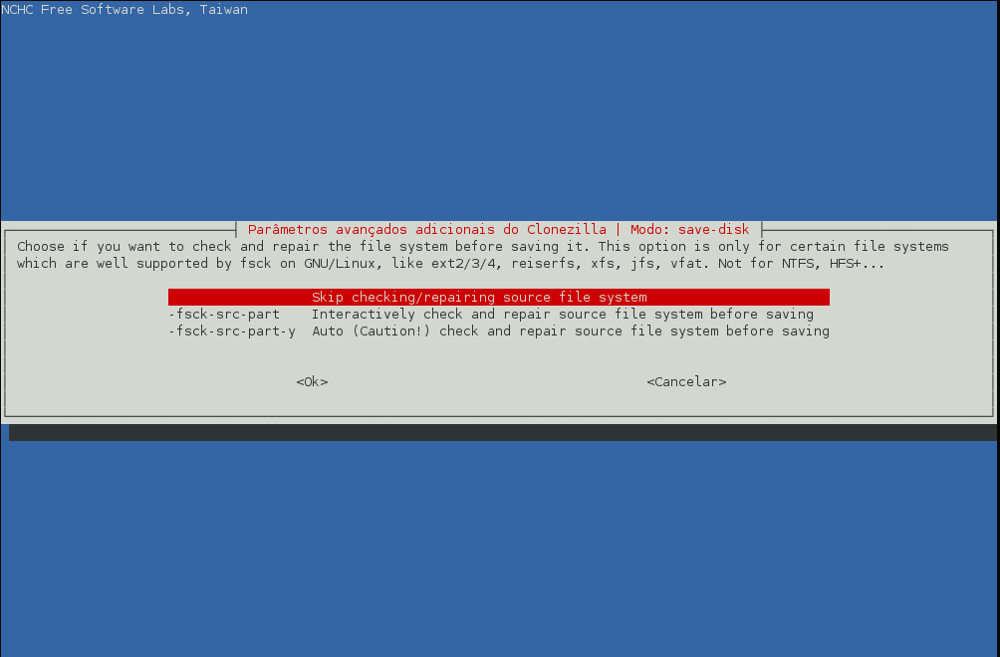

8️⃣ Verificação final e ação após backup

Escolha:
````
Sim, verificar a imagem salva
````

E:
````
-p reboot
````

Para reiniciar o cliente ao final.

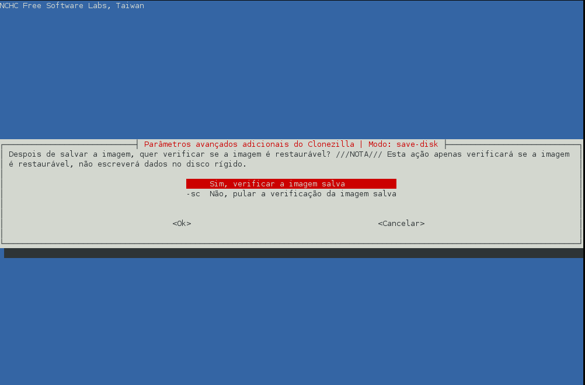

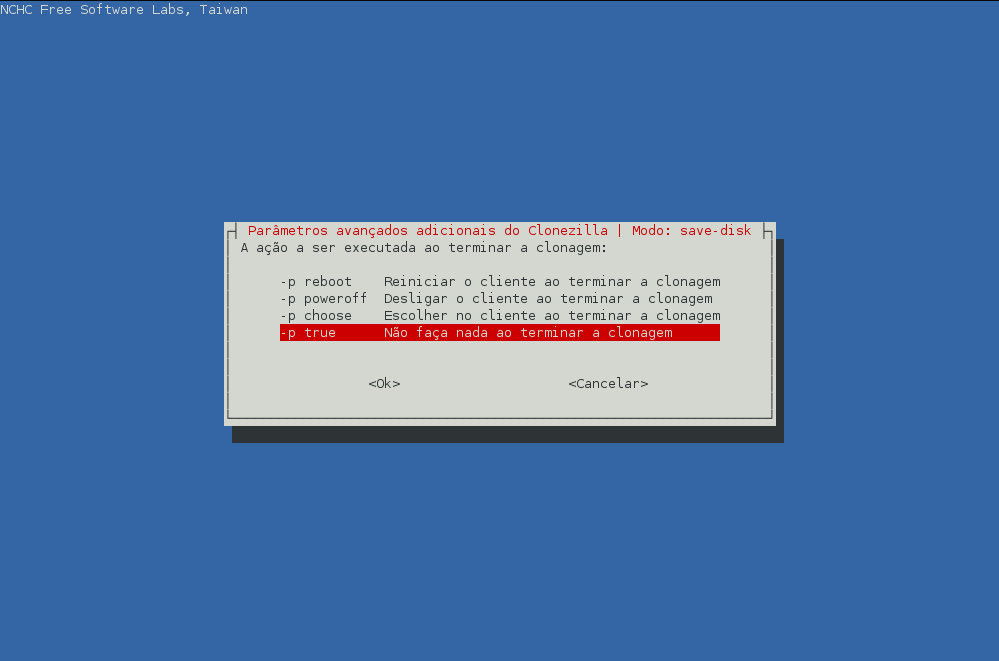

9️⃣ Escolhendo o compactador

Selecione:
````
-z1p
````
(Gzip com boa compactação)

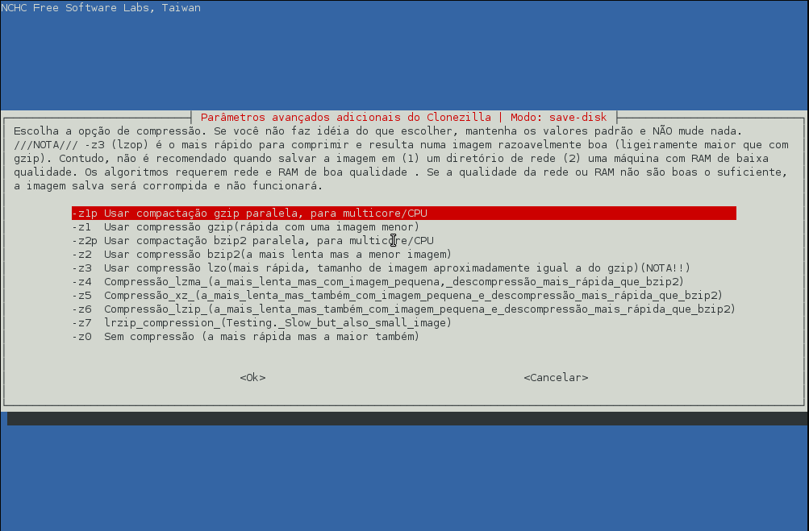

🔟 Tamanho máximo por arquivo

Defina:
````
4096 MB
````
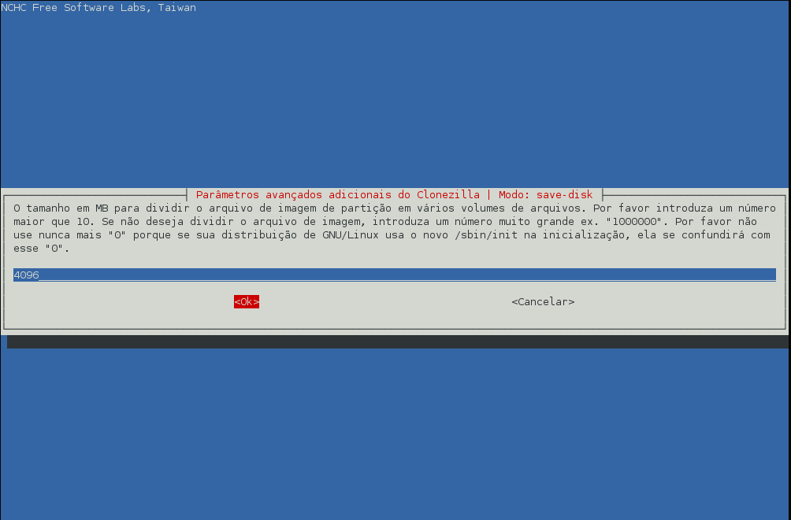

🖥️ Máquinas Clientes

Agora reinicie as máquinas clientes e inicialize via rede

1️⃣ Tela inicial do cliente

Escolha:
````
Clonezilla: save-disk
````
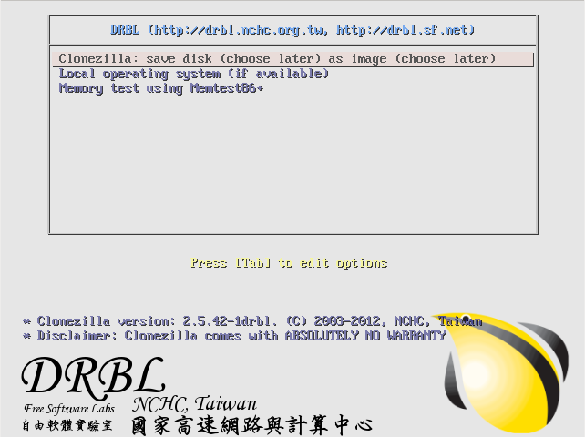

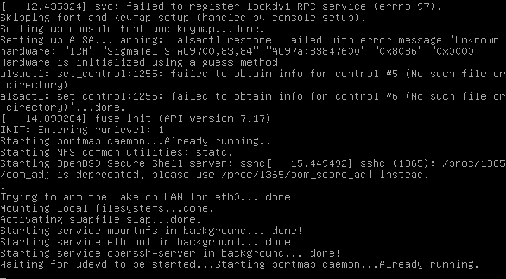

2️⃣ Nome da imagem de backup

Informe o nome desejado:

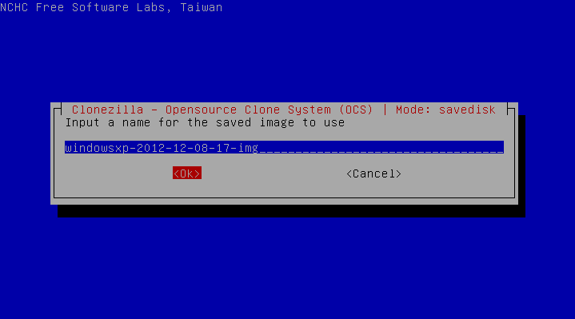

3️⃣ Escolha o disco a ser clonado

Exemplo:
````
sda
````
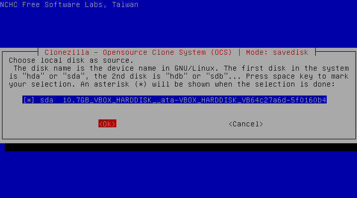

4️⃣ Clonagem em andamento

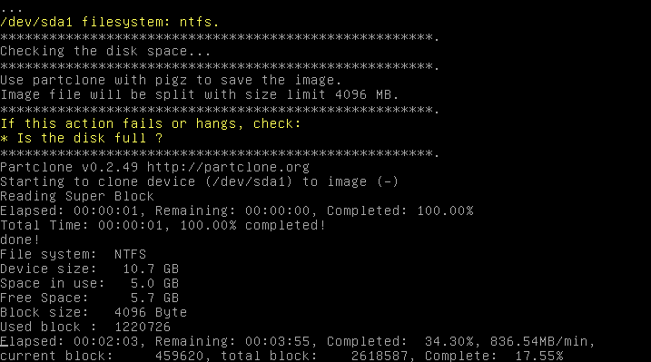

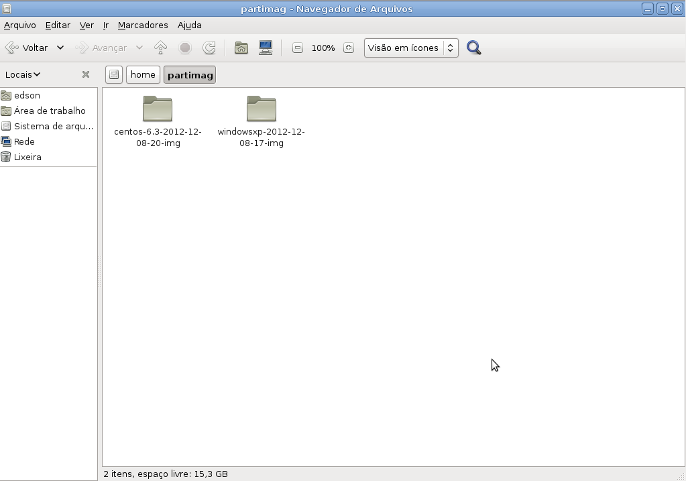

⛔ Parando o Servidor Clonezilla - apos conclusão

Após concluir a clonagem, execute:
````
/usr/sbin/dcs clonezilla-stop
````

Selecione novamente:
````
All
````

A clonagem de partições também é possível usando:
````
save-parts
````
